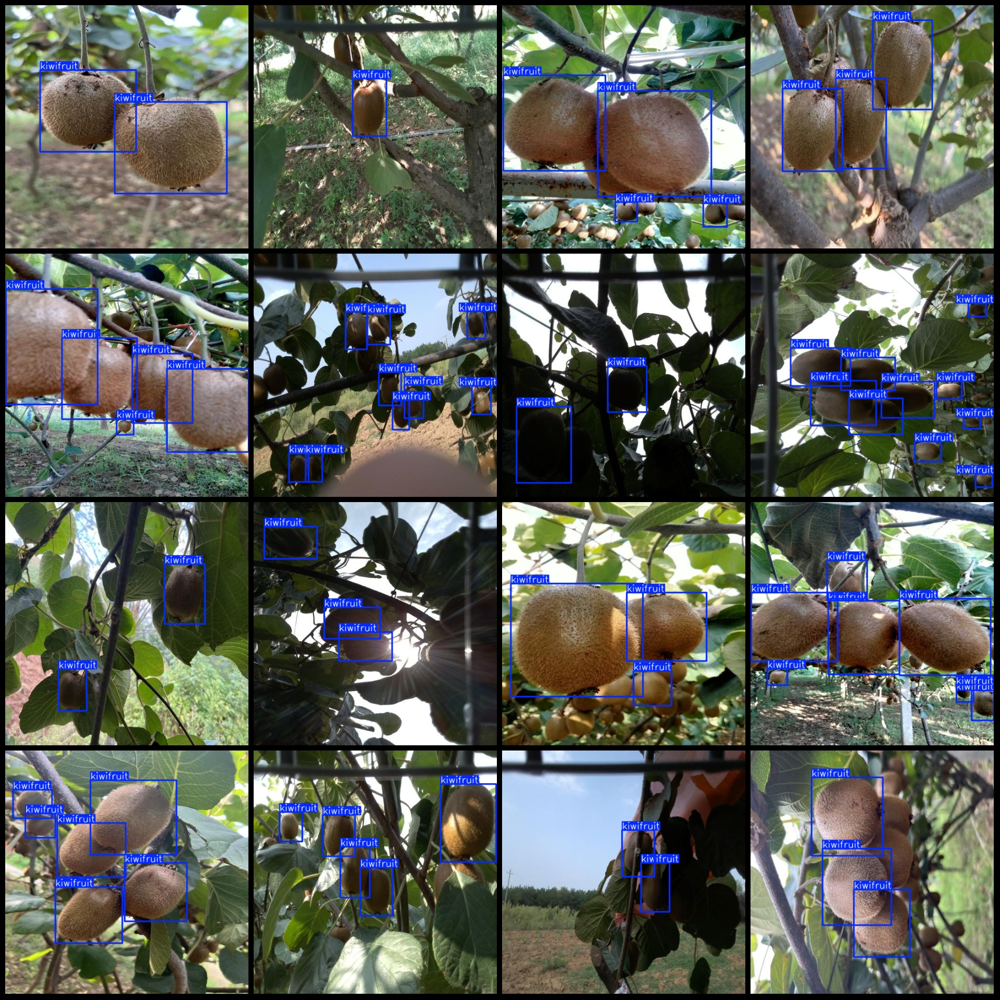
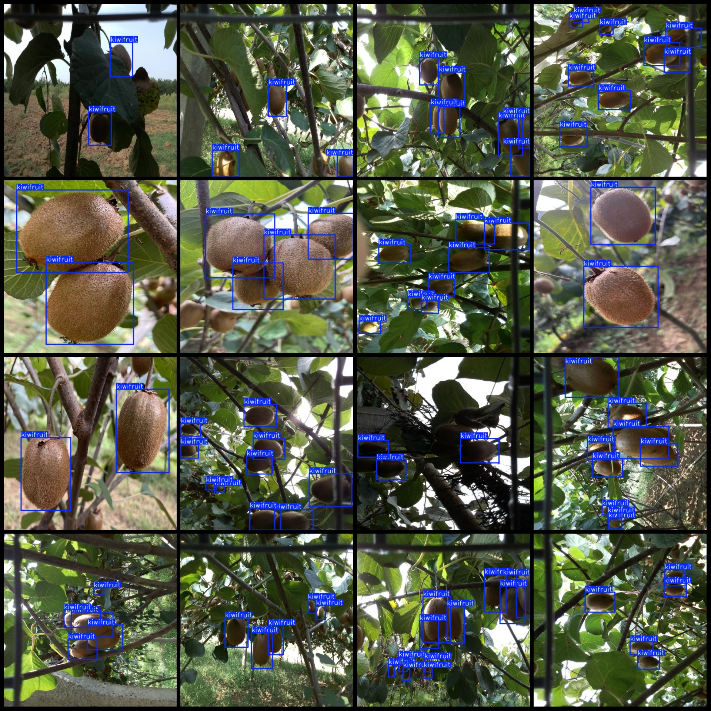

# Intelligent Agriculture: Tree-Based Strawberry Detection Dataset VOC+YOLO Format with 2810 Images in 1 Category

The dataset format includes both Pascal VOC and YOLO formats (excluding the segmentation path in the txt file, only containing jpg images along with corresponding VOC and YOLO format xml files and txt files).

Number of images: 2810
Number of annotations: 2810
Number of annotation files: 2810
Number of annotation categories: 1
Annotation category name: "kiwifruit"
Number of bounding box per category:
kiwifruit (Strawberry) = 13229
Total number of bounding boxes: 13229
Image resolution: 512x512
Annotation tool used: labelImg
Annotation rules applied: drawing bounding boxes for each category
Important note: No specific instructions provided at this time.
Special declaration: This dataset does not guarantee the accuracy of trained models or weight files.
Image preview:
Annotation example:

Image

Here is a pay link on Stripe ( https://buy.stripe.com/3cs8yP7sY87d0vu9AB ). Please contact me lonlonago@foxmail.com after funding $89, and I will send you a complete data files , thank you!

